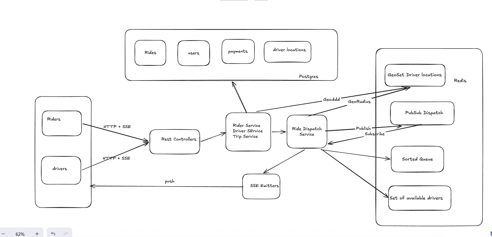
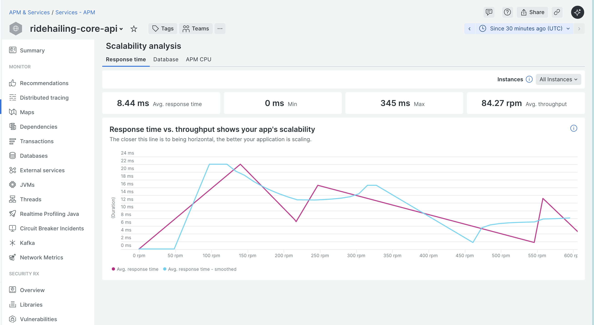

# GoComet Ride-Hailing System

A ride-hailing platform built with Spring Boot, React, PostgreSQL, and Redis.

## Quick Start

### Docker

```bash
docker-compose up --build
```

- Frontend: http://localhost:3000
- API: http://localhost:9000/v1
- Swagger: http://localhost:9000/v1/swagger-ui.html

### Local Development

#### Prerequisites for running locally

- Java 21+
- PostgreSQL 15+
- Redis 7+
- Node.js 18+

---

## Architecture

### Tech Stack

- Backend: Kotlin 2.1.10, Spring Boot 3.4.4, MyBatis, JWT
- Database: PostgreSQL (transactional data), Redis (caching, geo lookups, pub/sub)
- Frontend: React 19, Vite, Leaflet.js (OpenStreetMap)
- Monitoring: New Relic Java Agent + Micrometer

### High-Level Design



### State Machines

```
Ride:   REQUESTED ──> ACCEPTED ──> IN_PROGRESS ──> COMPLETED
              \                                      /
               └──────────> CANCELLED <─────────────┘

Driver: OFFLINE <──> AVAILABLE ──> ON_TRIP ──> AVAILABLE
```

### Event-Driven Matching

Drivers are not auto-assigned. The system uses an event-driven approach where drivers self-select rides:

1. Rider creates ride → stored as REQUESTED in PostgreSQL
2. DispatchService publishes event to Redis Pub/Sub
3. All server instances receive event, find nearby drivers via Redis GEORADIUS
4. Available ride list pushed to each driver's SSE connection
5. Driver picks a ride and accepts → first wins (atomic transaction, others get 409)
6. Accepted ride removed from all other drivers' lists

### Redis Usage

| Key                  | Type    | Purpose                             |
|----------------------|---------|-------------------------------------|
| `driver:locations`   | GEO Set | Driver proximity lookups            |
| `driver:available`   | Set     | Track online drivers                |
| `ride:dispatch`      | Pub/Sub | Cross-instance event dispatch       |
| `ride:pending_queue` | Queue   | Ride radius expansion scheduling    |
| `ride:queue_lock`    | Lock    | Prevents duplicate queue processing |

### Surge Pricing

Based on available driver count within 5km of pickup (single Redis GEO call):

- 0 drivers → 2.0x
- 1-2 drivers → 1.5x
- 3-5 drivers → 1.2x
- 6+ drivers → 1.0x

### Search Radius Expansion

If no driver accepts a ride within 30s, the search radius expands progressively (5km → 10km → 15km → 20km max). Managed
by a Redis queue with distributed locking so only one instance processes at a time. Rider sees the search circle grow on
the map via SSE.

---

## API Reference

### Auth

| Method | Endpoint            | Description                |
|--------|---------------------|----------------------------|
| POST   | `/v1/auth/register` | Register (rider or driver) |
| POST   | `/v1/auth/login`    | Login, returns JWT         |

### Rides (Rider)

| Method | Endpoint                         | Description                    |
|--------|----------------------------------|--------------------------------|
| POST   | `/v1/rides`                      | Create ride request            |
| GET    | `/v1/rides/active`               | Get active or unpaid ride      |
| GET    | `/v1/rides/{id}`                 | Get ride details               |
| POST   | `/v1/rides/{id}/cancel`          | Cancel ride                    |
| GET    | `/v1/rides/{id}/events`          | SSE stream for ride updates    |
| GET    | `/v1/rides/{id}/driver-location` | Poll driver's current location |

### Drivers

| Method | Endpoint                            | Description                 |
|--------|-------------------------------------|-----------------------------|
| PUT    | `/v1/drivers/me/location`           | Update location             |
| PUT    | `/v1/drivers/me/status`             | Go online/offline           |
| GET    | `/v1/drivers/me/status`             | Get current status          |
| GET    | `/v1/drivers/me/active-ride`        | Get active trip             |
| GET    | `/v1/drivers/me/rides/stream`       | SSE stream for nearby rides |
| POST   | `/v1/drivers/me/rides/{id}/accept`  | Accept a ride               |
| POST   | `/v1/drivers/me/rides/{id}/decline` | Decline a ride              |

### Trips & Payments

| Method | Endpoint                   | Description                |
|--------|----------------------------|----------------------------|
| POST   | `/v1/trips/{rideId}/start` | Start trip                 |
| POST   | `/v1/trips/{rideId}/end`   | End trip + calculate fare  |
| POST   | `/v1/payments`             | Process payment (PSP stub) |

---

## Requirement Coverage

### 1. Business Logic

- All core APIs implemented with input validation
- Trip lifecycle with state machine enforcement
- Duplicate ride creation blocked, concurrent accept returns 409
- Edge cases handled: timeouts (radius expansion), declined offers (re-dispatch), state recovery on reload
- Soft deletes on all tables
- Payment enforcement: unpaid rides block new ride creation

### 2. Scalability & Reliability

- Driver locations in Redis GEO for fast proximity lookups
- Redis Pub/Sub for cross-instance SSE dispatch
- Redis queue with distributed lock for ride expansion
- Location writes batched and bulk-inserted every 5s
- All components stateless — shared state in PostgreSQL and Redis

### 3. New Relic Monitoring

- Java agent for transaction tracing and query analysis
- Micrometer exports JVM and HTTP metrics
- API latencies tracked per endpoint



### 4. API Latency Optimization

- Redis GEO replaces SQL joins for driver lookups
- Database indexes on ride status and location columns
- Redis-first reads for driver locations with PostgreSQL fallback
- Bulk inserts reduce DB write pressure

### 5. Atomicity & Consistency

- `@Transactional` on all multi-write operations
- Concurrent ride acceptance: first driver wins, others get 409
- Redis state kept in sync with PostgreSQL

### 6. Frontend with Live Updates

- Rider: map with markers, SSE for status updates, driver location polling, expanding search radius
- Driver: SSE-pushed ride list, accept/decline per ride, trip simulation
- State recovery on page reload for both rider and driver

---

## Testing

```bash
cd core-api
./mvnw test
```

Unit tests cover:

- Haversine distance calculation
- Fare calculator (base fare, surge multiplier)
- Ride state machine transitions
- Driver state machine transitions
- Status enum resolution

---

## Future Scope

- PostGIS for spatial queries
- WebSocket upgrade from SSE
- Real PSP integration
- Redis-backed rate limiting
- Ride tier support
- Driver ratings and feedback

         
